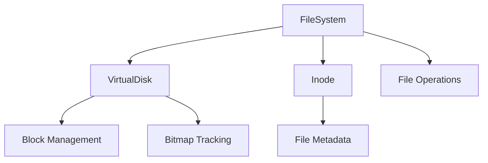

# PyFileSystem

A Python-based file system implementation that demonstrates core operating system concepts through a practical, working example. This project provides a low-level implementation of file system operations, block management, and inode-based file tracking.

## 📖 Overview

PyFileSystem is an educational project that implements a basic file system from scratch. It demonstrates fundamental concepts like block allocation, inode management, and file operations while maintaining a clean, modular architecture.



## 🏗️ Architecture

The system is built on three core components:

### 1. Virtual Disk
- Simulates a physical disk using a file
- Manages block allocation and deallocation
- Implements bitmap-based free space tracking
- Block size: 4KB (configurable)
- Default disk size: 1MB

### 2. Inode Management
- Tracks file metadata and block locations
- Stores file attributes (name, size, creation time)
- Maintains block list for each file
- JSON-based serialization for persistence

### 3. File System Operations
- High-level file operations (create, read, write, delete)
- Block allocation and management
- Inode table maintenance
- Error handling and validation

## 💻 Usage Example

```python
from lib.FileSystem import FileSystem

# Initialize file system
fs = FileSystem("test_disk.bin")

# Create and write to a file
fs.create_file("example.txt")
fs.write_file("example.txt", b"Hello, File System!")

# Read file contents
data = fs.read_file("example.txt")
print(data.decode())  # Outputs: Hello, File System!

# List all files
files = fs.list_files()
for file_info in files:
    print(file_info)
```

## 🔍 Implementation Details

The file system implements several key concepts:

1. **Block Management**
   - Efficient block allocation using bitmap
   - Free space tracking
   - Block-level read/write operations

2. **File Operations**
   - Create/delete files
   - Read/write with offset support
   - File listing and metadata access

3. **Data Persistence**
   - Persistent inode table
   - File data block management
   - System state recovery

## 🛠️ Technical Concepts Demonstrated

- Block device operations
- File system metadata management
- Memory mapping and block allocation
- File operation atomicity
- Error handling and recovery
- System-level I/O operations

## 🎯 Project Motivation

This project was created to gain a deep, practical understanding of how file systems work at a fundamental level. By implementing these concepts from scratch, it provides insights into:

- Operating system internals
- File system design principles
- Block device management
- System-level programming concepts

## 🧪 Testing

The project includes comprehensive tests for all components:

```python
python -m pytest test/VirtualDiskTest.py
```

## 📚 Learning Outcomes

Through this project, I gained practical experience with:
- Low-level system programming
- File system architecture and design
- Block device management
- Metadata handling and persistence
- Error handling in system programming

## 🚀 Future Enhancements

- Directory support
- File permissions
- Journaling
- Caching system
- Symbolic links

---
Created by Malik as an educational project to explore file system internals and operating system concepts.